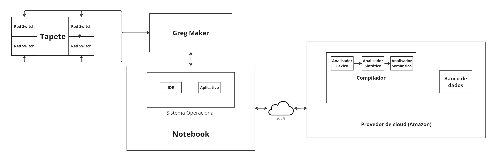

# Diagrama de Blocos
O diagrama de blocos apresenta a arquitetura do sistema do projeto de tapete sensorial, descrevendo como cada componente interage e comunica entre si. Iniciando com o tapete, que contém múltiplos "Red Switches", sensores de pressão que detectam a interação física. Estes transmitem sinais para o "Greg Maker", um microcontrolador que atua como o cérebro do tapete, processando os sinais recebidos. O "Greg Maker" é conectado a um notebook via USB, enviando os dados processados para o sistema operacional do notebook.

Dentro do notebook, uma IDE (Ambiente de Desenvolvimento Integrado) é utilizada para o desenvolvimento e teste do aplicativo que gerencia as atividades e reforços terapêuticos. O aplicativo, rodando sobre o sistema operacional, usa esses dados processados tanto para apresentar uma interface interativa para o usuário quanto para enviar informações pertinentes para um servidor na nuvem via Wi-Fi, onde estão hospedados serviços de back-end, como armazenamento de dados e processamento adicional (compilador). O provedor de cloud (AWS) armazena, processa e gerencia os dados de sessões terapêuticas, facilitando a acessibilidade e a análise longitudinal do progresso das crianças com TEA. Essa infraestrutura permite um ecossistema integrado que combina interação física, processamento local e capacidades ampliadas via computação em nuvem, resultando em uma experiência terapêutica rica e adaptativa para usuários e terapeutas.

Imagem 01: Diagrama de Blocos
   
  Fonte: Elaborado pelos autores.

## Dispositivos e Interfaces

### Dispositivos Computacionais:
- **Notebook:** Dispositivo central para o terapeuta, utilizado para configurar e controlar as atividades do tapete sensorial. Possui software para processamento de dados, visualização de resultados, e comunicação com o Greg Maker e o provedor de cloud.
- **Provedor de Cloud (Amazon):** Servidores em nuvem que fornecem recursos computacionais, armazenamento e serviços de rede.

### Dispositivos de Entrada e Saída:
- **Tapete com Switch Red:** Dispositivo sensorial que registra a interação física, com cada switch desenhado para detectar a pressão e traduzir movimentos em dados digitais, enviando os sinais para o Greg Maker.
- **Greg Maker:** Placa de desenvolvimento eletrônico que atua como o cérebro do tapete, lendo os sinais dos sensores de pressão e transmitindo esses dados para o notebook via interface USB.

### Interfaces de Comunicação:
- **USB:** A conexão USB proporciona uma transferência de dados direta e confiável entre o Greg Maker e o notebook.
- **Wi-Fi:** Interface de comunicação sem fio entre o notebook e o provedor de cloud.

### Dispositivos Montados pelo Grupo:
- **Greg Maker:** Placa de microcontrolador que consiste nos seguintes componentes:
    - Microcontrolador ATmega328P
    - Sensor de pressão MPX6015
    - Módulo de comunicação serial USB-UART
    - Resistores
    - Capacitores
    - Conectores

## Descrição Detalhada

### Tapete com Switch Red:
- **Descrição:** O tapete é a interface tangível com a qual a criança interage, cada switch red captura um tipo específico de interação.
- **Componentes de Software:** Não aplicável diretamente, mas é complementado pelo firmware do Greg Maker.
- **Funcionalidades:**
  - Traduzir interações físicas em sinais eletrônicos que são interpretados pelo Greg Maker.

### Greg Maker:
- **Descrição:** Processa sinais de entrada dos switches red e envia dados para o notebook para análise e resposta.
- **Componentes de Software:** Firmware personalizado que gerencia a entrada dos sensores e a comunicação com o notebook e possui um Driver do sensor de pressão.
- **Funcionalidades:**
    - Coletar dados do sensor de pressão.
    - Processar os dados do sensor de pressão.
    - Enviar os dados do sensor de pressão para o notebook.

### Notebook:
- **Descrição:** O notebook serve como a estação de trabalho do terapeuta, permitindo o controle das sessões terapêuticas e a análise dos dados coletados.
- **Componentes de Software:** Possui um navegador web moderno, um software cliente para acessar serviços de cloud, e uma interface de usuário customizada para facilitar a interação com o tapete sensorial.
- **Funcionalidades:**
    - Permitir o monitoramento em tempo real das sessões terapêuticas
    - Permitir configuração personalizada das atividades no tapete.
    - Acionar o Greg Maker para enviar dados do sensor de pressão.
    - Acessar os recursos da nuvem e executar aplicações.
    - Visualizar os dados do sensor de pressão.

### Provedor de Cloud:
- **Descrição:** Armazena dados de forma segura, executa serviços de processamento de dados e fornece recursos para o funcionamento do software terapêutico.
- **Componentes de Software:** Inclui serviços de banco de dados, como Amazon RDS, sistema de armazenamento de arquivos, como o S3, ambientes de execução como AWS Lambda, e soluções de gerenciamento de API.
- **Funcionalidades:**
    - Armazenar os dados do sensor de pressão.
    - Fornecer recursos computacionais para o processamento dos dados.
    - Oferecer serviços de rede para a comunicação entre os dispositivos.
