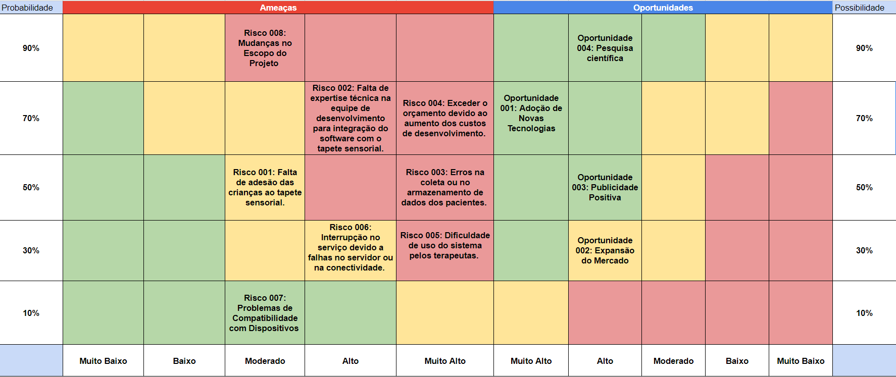
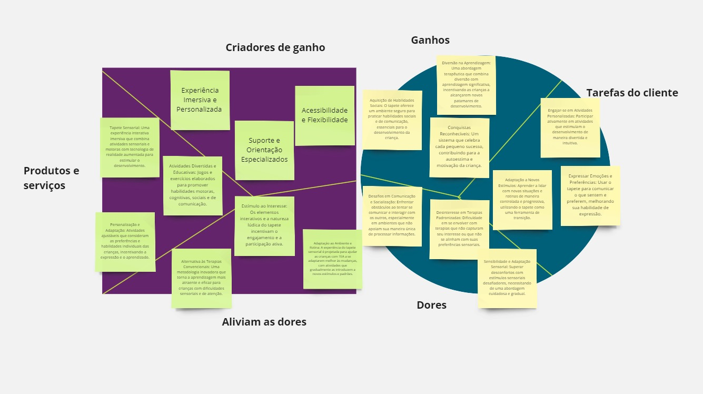
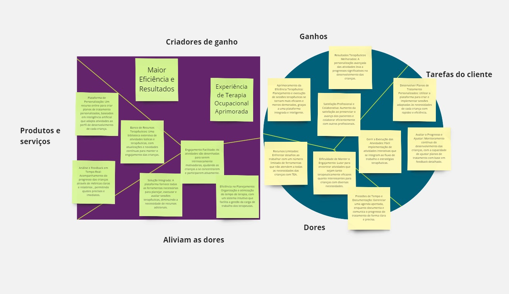

# Entendimento de Negócios

## Matriz de Riscos
A matriz de risco é uma ferramenta essencial para o gerenciamento de riscos de um projeto. Essa matriz é composta por dois blocos principais: **oportunidades** e **ameaças**. Ambas as partes contêm células que representam acontecimentos que possuem um certo nível de probabilidade de acontecer e um certo nível de impacto causado se eles, de fato, ocorressem. 

As medidas de probabilidade e impacto estão indicadas pelas setas na vertical e na horizontal na ilustração abaixo, respectivamente.

Abaixo, está a ilustração da matriz de risco:

Imagem 01: Matriz de Riscos
   
  Fonte: Elaborado pelos autores.

Para acessar diretamente o arquivo de matriz de riscos, <a href="https://docs.google.com/spreadsheets/d/1oiHVZqg091S3Ox9sj5Nrzdeii3CqBvwoDQTMOzMYXek/edit#gid=0">clique aqui.</a>

A seguir, temos a descrição de cada risco e uma forma de mitigação para as ameaças.

## Ameaças
**Risco 001: Falta de adesão das crianças ao tapete sensorial.**
  - Descrição: Crianças podem não se sentir atraídas ou engajadas pelas atividades propostas pelo tapete sensorial, o que afetaria diretamente a eficácia da ferramenta terapêutica.
  - Mitigação: Desenvolvimento de atividades atrativas e envolventes, adaptadas aos interesses individuais das crianças.

**Risco 002: Falta de expertise técnica na equipe para integração do software com o tapete sensorial.**
- Descrição: A equipe pode enfrentar dificuldades técnicas na implementação de funcionalidades do software, comprometendo a qualidade e a entrega do projeto.
- Mitigação: Todos membros da equipe realizar os autoestudos necessários para realizar a integração do software com o tapete sensorial.

**Risco 003: Erros na coleta ou no armazenamento de dados dos pacientes.**
- Descrição: Podem ocorrer falhas técnicas que levem à perda de informações importantes dos pacientes, impactando o acompanhamento terapêutico e a personalização das atividades.
- Mitigação: Implementação de um sistema robusto de gerenciamento de dados com backups regulares.

**Risco 004: Exceder o orçamento devido ao aumento dos custos de desenvolvimento.**
- Descrição: A gestão inadequada dos recursos financeiros pode resultar em custos superiores aos previstos, colocando em risco a viabilidade financeira do projeto.
- Mitigação: Monitoramento financeiro constante e ajuste de expectativas.

**Risco 005: Dificuldade de uso do sistema pelos terapeutas.**
- Descrição: A complexidade da interface ou funcionalidades do software pode resultar em uma curva de aprendizado íngreme para os terapeutas, potencialmente diminuindo a eficiência das sessões.
- Mitigação: Treinamento dos terapeutas e um manual de uso bem detalhado.

**Risco 006: Interrupção no serviço devido a falhas no servidor ou na conectividade.**
- Descrição: Interrupções de serviço podem ocorrer devido a problemas técnicos com o servidor ou conectividade, afetando a disponibilidade e a continuidade do tratamento.
- Mitigação: Implementar soluções de redundância e planos de recuperação de desastres.

**Risco 007: Problemas de Compatibilidade com Dispositivos**
- Descrição: Pode haver incompatibilidade do software com diferentes dispositivos ou sistemas operacionais, o que limitaria seu uso em diversos contextos terapêuticos.
- Mitigação: Realizar testes de compatibilidade em diversos dispositivos e sistemas operacionais.

**Risco 008: Mudanças no Escopo do Projeto**
- Descrição: Alterações não planejadas nas metas ou funcionalidades do projeto podem levar a estouros de prazo e orçamento, além de confusão entre os membros da equipe.
- Mitigação: Estabelecer um processo de controle de mudanças e manter uma comunicação clara com os stakeholders.

## Oportunidades
**Oportunidade 001: Adoção de Novas Tecnologias**
  - Descrição: A integração de novas tecnologias, como inteligência artificial para personalização das atividades, pode aumentar significativamente o valor terapêutico do tapete sensorial.

**Oportunidade 002: Expansão do Mercado**
  - Descrição: A expansão para novos mercados ou demografias, como adultos com necessidades especiais, pode aumentar o alcance e o impacto social do projeto.

**Oportunidade 003: Publicidade Positiva**
  - Descrição: Histórias de sucesso e estudos de caso documentando os benefícios do projeto podem atrair atenção positiva da mídia e aumentar o reconhecimento do projeto.

**Oportunidade 004: Pesquisa científica**
  - Descrição: Com a abordagem inovadora de oferecer tapetes sensoriais integrados a um software para crianças com TEA, será possível elaborar um artigo científico, a fim de analisar os impactos do projeto na melhoria do quadro dos pacientes.

## Matriz de oceano Azul

A Matriz de Oceano Azul é uma ferramenta estratégica que auxilia empresas a navegar em mercados inexplorados, buscando oportunidades de crescimento rentável.

#### Reduzir:

Nessa ação, a ideia é reduzir ou simplificar características presentes em produtos ou serviços tradicionais, tendo em vista que a mudança não impacta negativamente o usuário.

##### Aumentar:

Nessa ação, o foco está em ampliar os atributos que são valorizados pelos clientes, visando proporcionar maior valor e eficiência do que os concorrentes oferecem aos usuários finais.

#### Criar:

Essa ação envolve a criação de um atributo. Ou seja, seria o diferencial da solução em relação aos demais concorrentes.

#### Eliminar:

Nessa ação, a estratégia envolve a remoção de atributos que a concorrência pode considerar essenciais, mas que, na realidade, não afetam significativamente o valor percebido pelo cliente.

### Matriz de Avaliação de Valor

Para realizar a avaliação de valor foi pesquisado empresas concorrentes que tivessem alguma semelhança com a solução criada.

Dentre elas estão:

**Instituições Relacionadas:**

- Escola de Educação Física, Fisioterapia e Terapia Ocupacional (EEFFTO) da Universidade Federal de Minas Gerais
- CEATD
- AACD
- APAE

##### Atributos:

**Análise de Instituições Relacionadas**

A análise de concorrentes foi realizada considerando os seguintes atributos:

* 1 Área de Cobertura
* 2 Variedade de tratamentos
* 3 Tecnologias de ponta
* 4 Integração com a comunidade acadêmica e pesquisa1
* 5 Custo dos serviços
* 6 Parcerias com outras instituições
* 7 Formação e Qualificação de Profissionais
* 8 Impacto Social Mensurável

#### **Reduzir:**

- **Custo dos serviços:** Ao analisar os serviços fornecidos pelas ONGs, levamos em consideração a variedade de assistência e suporte oferecidos, bem como sua acessibilidade e os custos associados. No caso da Escola de Educação Física, Fisioterapia e Terapia Ocupacional (EEFFTO), observamos que ela pode fornecer serviços nessas áreas a preços mais acessíveis, embora ainda possam existir custos associados, portanto, atribuímos uma nota de 7. Tanto a APAE quanto o CEATD e a FOFITO seguem um modelo semelhante, e por isso atribuímos a mesma pontuação para ambos. Por outro lado, a AACD é reconhecida por oferecer uma ampla gama de serviços de reabilitação para pessoas com deficiências físicas. Devido à alta qualidade e especialização desses serviços, os custos podem ser mais elevados em comparação com outras instituições, e por isso atribuímos uma pontuação de 10.

#### **Aumentar:**

* **Área de Cobertura:** Ao avaliar a área de cobertura das instituições relacionadas, observamos que cada uma possui características distintas em termos de alcance geográfico e capacidade de serviço, a EEFTO, sendo parte de uma universidade federal, apresenta potencial significativo para aumentar sua área de cobertura, especialmente por meio de programas de extensão, porém sua atuação tende a ser mais concentrada no estado de Minas Gerais, recebendo uma nota 6.
  O CEATD possui um alcance mais limitado a Fortaleza, no Ceará, mas mantem uma concentração eficaz dos recursos, recebendo uma nota 4.
  Por outro lado, a AACD oferece uma cobertura nacional mais ampla, estabelecendo-se como uma instituição com grande capacidade de atender diversas regiões por conta das suas diversas unidades pelo Brasil e por isso, será atribuída uma nota 9 para ela.
  a APAE destaca-se na presença nacional devido ao seu grande número de filiais espalhadas pelo Brasil, que permitem um alcance extenso e a capacidade de servir comunidades em todo o país, inclusive em áreas mais remotas, por isso também receberá uma nota 9.
  Por ser ligada a faculdade de Medicina da USP, a FOFITO tem uma vasta área de cobertura, atendendo inclusiva em postos de sáude ligados a USP, como centro de saúde Samuel Barnsley. Com essa vasta área de cobertura, abrangendo grande parte da cidade de São Paulo, concederemos a nota 9 para a FOFITO.
* **Impacto Social Mensurável:** Ao avaliar o impacto social mensurável das instituições, observamos que a AACD é reconhecida por seu impacto significativo na vida de pessoas com deficiências físicas, e incentivam doações por meio de sorteios, trazendo cada vez mais doadores, por isso atribuímos uma nota 9. Em seguida, a APAE, que oferece serviços abrangentes para pessoas com deficiência intelectual e múltipla, recebendo uma nota 8. O CEATD contribui para o desenvolvimento de indivíduos com autismo e suas famílias, e por isso atribuímos a nota 7. A FOFITO, com seu trabalho na área de fisioterapia, também tem um impacto mensurável, especialmente na reabilitação física de indivíduos, além de ter um departamento para o tratamento de pessoas com TEA , assim recebendo uma nota 8. Por fim, a EEFFTO  tem potencial para ter um impacto social mensurável ao formar profissionais qualificados nas áreas de educação física, fisioterapia e terapia ocupacional, contribuindo assim para a promoção da saúde e inclusão social. Essas organizações têm um impacto mensurável em suas áreas de atuação, promovendo o bem-estar e o desenvolvimento das comunidades que servem, e por esses motivos atribuímos a nota 10.

- **Tecnologia de Ponta :** Analisando o uso de tecnologias de ponta nas instituições relacionadas, percebemos variações significativas em termos de adoção de novas tecnologias e métodos avançados de tratamento. A EFFTO, por estar vinculadas a uma instituição acadêmica , tem acesso a pesquisas e tecnologias relativamente atuais. Isso facilita a integração de inovações tanto no ensino quanto no tratamento. Por isso será atribuído uma nota 8 para ela.
  O CEATD é uma clínica particular especializada em autismo, ela utiliza tratamentos atuais mas em uma escala um pouco mais restrita comparada com grandes centros médicos, por isso lhe será atribuída uma nota 7.
  Já a AACD se destaca no uso de tecnologia de ponta, implementando equipamentos e técnicas modernas que são essenciais para o acompanhamento e tratamento dos pacientes. A capacidade de oferecer tratamentos inovadores e especializados lhe confere uma nota 9.
  a APAE serve uma ampla gama de necessidade e também faz o uso de tecnologias adaptativas e educacionais para melhor atender o seu público. No entanto, a sofisticação tecnológica pode variar muito entre as suas unidades, resultando em uma nota 7.
  A FOFITO se destaca significativamente no uso de tecnologia de ponta, graças a sua associação com uma das principais instituições de pesquisa medica do Brasil, a FOFITO tem acesso a tecnologias avançadas e inovadoras provenientes de pesquisas, por exemplo. Por isso, será concedida a ela a nota 9.
- **Variedade de tratamentos:** Em relação a variedade de tratamentos oferecidos pelas instituições relacionadas, A EEFFTO, sendo parte de uma instituição acadêmica, tem a vantagem de integrar constantemente novas práticas e teorias em seus tratamentos, oferecendo uma ampla variedade de de serviços nas áreas de educação física, fisioterapia e terapia ocupacional e por isso lhe será atribuída uma nota 9.
  O CEATD proporciona uma gama de tratamentos especializados que são cruciais para o desenvolvimento e bem-estar dos pacientes com o diagnóstico de TEA. Embora mais limitada em diversidade quando comparada a instituições de reabilitação mais amplas, a especialização do CEATD garante tratamentos eficazes e focados, resultando em uma nota 7.
  a AACD oferece um espectro extenso de tratamentos reabilitativos, incluindo terapias físicas, ocupacionais, e tecnologias assistivas de última geração. Essa ampla variedade em combinação com a sua alta especialização em cada um de seus serviços garante a AACD uma nota 9.
  a APAE também apresenta uma variedade de tratamentos que abrangem desde a educação especializada até a terapias de suporte comportamental e ocupacional. Essa abordagem holística e inclusiva da APAE é essencial para atender aas diversas necessidades de seu público, lhe garantindo uma nota 8.
  Por fim, a FOFITO também se destaca por sua variedade de tratamentos, Com um forte enfoque em pesquisas e desenvolvimentos de noivas práticas, Sua proximidade com um dos maiores centros de pesquisa médica do país permite que ela incorpore rapidamente as últimas descobertas científicas em seus programas de tratamento. Isso garante não apenas a atualização contínua dos métodos terapêuticos, mas também a personalização dos cuidados de acordo com as necessidades específicas de cada paciente. O que lhe atribui uma nota 9.

* **Integração com a comunidade acadêmica e pesquisa:** Analisando a integração com a comunidade acadêmica e pesquisa, a EEFFTO destaca-se nesse aspecto. Como parte de uma universidade federeal, a EFFETO está diretamente ligada e envolvida com pesquisas acadêmicas, desenvolvendo novas metologias e colaborando com a comuniodade científica, por isso a EEFTO recebe nota 10 nesse aspecto.
  O CEATD apesar de seu foco específico em autismo, não mantém tantas colaborações com entidades acadêmicas afim de fomentar pesquisas que melhoram o entendimento e tratamento do autismo, por isso lhe será concedido uma nota 3 nesse aspecto.
  A ACCD se envolve em pesquisas e desenvolvimento, especialmente na criação e adaptacao de tecnologias reabilitativas. Sua colaboracao com instituicoes de pesquisa e universidades fortalece seu papel como lider em tratamentos inovadores, lhe concedendo uma nota 9.
  A APAE, conhecida por seu trabalho abrangente com pessoas com deficiência tambem participa de pesquisas e projetos acadêmicos, especialmente em áreas relacionadas a educação especial e desenvolvimento humano, também lhe concedendo uma nota 9.
  Por fim, a FOFITO tambem se destaca igualmente na integração com a comunidade acadêmica e pesquisa, especialmente na área de fisioterapia. A instituição está fortemente envolvida em estudos avançados e colaborações com a comunidade cientifica, promovendo inovação e a disseminação de novas técnicas e tratamentos. Por tudo isso, a FOFITO receberá nota 10 nesse aspecto.
* **Formação e Qualificação de Profissionais :** Com base em sua contribuição para a formação e qualificação de profissionais, observamos que a EEFFTO desempenha um papel importante na formação de graduados e pós-graduados em educação física, fisioterapia e terapia ocupacional, então atribuímos o valor 10. Em seguida, a AACD, o CEATD e a APAE oferecem programas de capacitação e treinamento para profissionais da área de reabilitação, autismo e deficiência intelectual, assim recebendo 8. Além disso, a FOFITO contribui para a formação de profissionais da área de fisioterapia, oferecendo programas de qualificação e treinamento. Essas iniciativas visam melhorar a qualidade do atendimento e suporte oferecidos às pessoas com deficiência física, autismo e outras necessidades especiais, contribuindo assim para o desenvolvimento de profissionais qualificados e competentes nesses campos, por isso atribuímos também a nota 10.

#### **Criar:**

* **Parcerias com outras instituições:** Avaliando as ONGs com base em suas parcerias com outras instituições, observamos que a APAE, o CEATD e a AACD são destacadas por suas colaborações estratégicas com organizações governamentais, privadas e da sociedade civil. Essas parcerias fortalecem os recursos e o apoio disponíveis para as comunidades atendidas, ampliam o acesso a serviços especializados e promovem melhores resultados para os beneficiários, recebendo a nota 10 às três ONGs. Além disso, a FOFITO, com seu trabalho na área de fisioterapia, também pode estabelecer parcerias estratégicas com outras instituições de saúde e educação para enriquecer seus serviços e ampliar seu alcance, contribuindo assim para o desenvolvimento profissional e a qualidade do atendimento oferecido, assim atribuímos a nota 5, assim trazendo um ponto onde a FOFITO pode aumentar seu portifólio com parcerias com outras instituições. Por fim, a EEFFTO que tem apoio da Secretaria Especial de Esporte do Ministério da Cidadania e a parceria com o Comitê Paralímpico Brasileiro também pode aumentar as parcerias para promover a pesquisa, o ensino e a prestação de serviços nas áreas de educação física, fisioterapia e terapia ocupacional, beneficiando tanto a comunidade acadêmica quanto a sociedade em geral, por isso demos a nota de 8.

#### **Eliminar:**

## Análise Financeira do desenvolvimento da IDE com o Tapete Sensorial para a FOFITO:

#### **1. Introdução:**

O projeto visa desenvolver uma IDE que usa um tapete sensorial para estimular crianças com Transtorno do Espectro Autista (TEA) em Terapia Ocupacional. A análise financeira considera os custos de desenvolvimento, materiais e implementação, além dos potenciais benefícios para o LEIA (Laboratório de Estudos e Intervenções em Autismo).

#### **2. Investimentos Projetados:**

###### **2.1. Serviços profissionais:**

| **Descrição**     | Custo Mensal Estimado | **Tempo(meses)** | **Total** |
| ------------------------- | --------------------- | ---------------------- | --------------- |
| Equipe de desenvolvedores | R$ 20.000,00          | 3                      | R\$ 60.000,00  |

| Descrição         | Custo Mensal Estimado | Custo Anual Estimado |
| ------------------- | --------------------- | -------------------- |
| Manutenção da IDE | R\$ 1.000,00          | R$ 12.000,00         |

###### **2.2. Ferramentas AWS:**

| Descrição       | Custo Mensal Estimado | Custo Anual Estimado |
| ----------------- | --------------------- | -------------------- |
| Recursos em nuvem | R\$ 1.123,35          | R$ 13.480,20         |

###### **2.3. Tapete Sensorial:**

**Construção do Tapete:**

|   **Item**   | **Valor(un)** | **Quantidade** | **Total** |
| :-----------------: | :-----------------: | :------------------: | :-------------: |
|     Tapete EVA     |      R\$ 3,00      |          8          |    R$ 24,00    |
| Placa de Acrílico |      R\$ 15,00      |          8          |    R$ 120,00    |
|  Sensor Capacitivo  |      R\$ 12,00      |          32          |    R$ 100,99    |
|       Bornes       |      R\$ 8,75      |          18          |    R$ 157,50    |
|      Gregmaker      |       R\$ 500       |          1          |    R$ 500,00    |
| **Sub-Total** |          -          |          -          |    R$ 902,49    |

|       Item       | Custo Unitário | Custo Anual Estimado (500 unidades) |
| :--------------: | :-------------: | :---------------------------------: |
| Tapete sensorial |   R\$ 902,49   |            R$ 451.245,00            |

#### **3. Projeções de Custos:**

###### **3.1. Custos Iniciais:**

|              Item              | Custo                   |
| :-----------------------------: | ----------------------- |
|     Serviços Profissionais     | R$ 60.000,00            |
| Tapete sensorial (500 unidades) | R$ 451.245,00           |
|       Manutenção da IDE       | R$ 12.000,00            |
|        **Total:**        | **R$ 523.245,00** |

###### **3.2. Custos Operacionais Anuais:**

|       Item       | Custo Anual            |
| :---------------: | ---------------------- |
| Recursos em nuvem | R$ 13.480,20           |
| **Total:** | **R$ 13.480,20** |

###### **3.3 Total de Custos Anuais:**

| **Total dos custos iniciais** | **Total dos custos Operacionais** | **Total dos Custos Anuais** |
| ----------------------------------- | --------------------------------------- | --------------------------------- |
| **R\$ 523.245,00**            | **R$ 13.480,20**                  | **R$ 536.725,20**           |

#### **4. Projeções de Receitas:**

###### **4.1. Cálculo do Ponto de Equilíbrio:**

O ponto de equilíbrio representa a quantidade de unidades que precisamos vender para cobrir nossos custos fixos e variáveis.

* **Ponto de Equilíbrio = Custos Fixos Anuais / (Preço Unitário - Custo Unitário Variável)**

| **Custos Fixos Anuais** | **Preço Unitário** | **Custo Unitário Variável** | **Ponto de Equilíbrio (Unidades)** |
| ----------------------------- | -------------------------- | ----------------------------------- | ----------------------------------------- |
| **R\$ 415.477,20**      | **R$ 1.499,99**      | **R$ 902,49**                 | **899**                             |

###### **4.2. Aumento de Receitas:**

Cenário: Desenvolvemos e comercializamos uma IDE inovadora com um tapete sensorial, direcionada a terapeutas ocupacionais, psicólogos e outros profissionais que atendem crianças com TEA.

| Item                       | Quantidade                  | Valor Unitário        | Receita Bruta             |
| -------------------------- | --------------------------- | ---------------------- | ------------------------- |
| **Tapete sensorial** | **1000 unidades/ano** | **R\$ 1.499,99** | **R$ 1.499.990,00** |

**4.3. Imposto sobre Vendas (ICMS):**

O ICMS varia de acordo com o estado, portanto, é necessário considerar a alíquota específica para o cálculo da receita líquida. Assumindo uma alíquota média de 18%, a receita líquida seria:

* **Receita Líquida = Receita Bruta * (1 - ICMS)**

| **Receita Bruta**    | **ICMS** | **Total**          |
| -------------------------- | -------------- | ------------------------ |
| **R\$ 1.499.990,00** | **18%**  | **R$ 1.229.991,8** |

#### **4.4. ROI:**

O ROI (Return on Investment) é uma métrica financeira que mede o retorno obtido em relação ao investimento realizado. Ele é calculado pela fórmula:

* **ROI = (Receita Líquida - Total dos Custos Anuais) / Total dos Custos Anuais**

Considerando os valores da análise financeira, temos:

| **Receita Líquida** | **Total dos Custos Anuais** | **ROI** |
| -------------------------- | --------------------------------- | ------------- |
| **R$ 1.229.991,80** | **R$ 536.725,20**           | **29%** |

O ROI calculado é de 29%, o que indica que para cada unidade monetária investida, obtemos um retorno de 29%. Isso demonstra que o projeto tem um potencial significativo de ser financeiramente viável e lucrativo.

#### **5. Conclusão:**

Concluimos que a análise financeira do desenvolvimento da IDE com o Tapete Sensorial para TEA, foi identificado que precisamos vender 899 unidades de tapete sensorial por ano para cobrir seus custos e atingir o ponto de equilíbrio. Após o ponto de equilíbrio, cada unidade vendida nos gera lucro. Além disso, considerando o aumento de receitas projetado com a comercialização da IDE inovadora, direcionada a terapeutas ocupacionais, psicólogos e outros profissionais que atendem crianças com TEA, nossa empresa tem potencial para obter um retorno financeiro positivo e sustentável.

## Value Proposition Canvas
Criar um único Value Proposition Canvas (VPC) para um público abrangente como crianças com TEA e seus terapeutas pode ser desafiador. As necessidades e dores variam significativamente entre esses dois grupos. Para garantir que a proposta de valor seja realmente significativa e atenda às necessidades específicas de cada persona, optamos por criar dois VPCs distintos: VPC para crianças com TEA e VPC para Terapeutas Ocupacionais. Para melhor visualização do texto, <a hrf="https://miro.com/app/board/uXjVKOViWaY=/?share_link_id=331475208887"> clique aqui </a> para acessar o link do Miro.

Imagem 02: Value Proposition Canvas - Crianças com TEA
  
  Fonte: Elaborado pelos autores.

Imagem 03: Value Proposition Canvas - Terapeutas Ocupacionais
   
  Fonte: Elaborado pelos autores.

## Total Adressable Market (TAM)

### Definição
O TAM representa o total de receita possível que um produto ou serviço pode gerar se 100% do mercado potencial for atingido. Para o nosso caso, isso pode ser definido como quantas crianças com TEA poderiam se beneficiar do tratamento com o tapete sensorial que será desenvolvido.

### Análise Abrangente do Mercado

#### População-Alvo:
Crianças com TEA que moram na cidade de São Paulo. Como não há um dado exato que faça essa metrificação, precisaremos fazer uma estimativa.
Considerando que há cerca de 869.479 crianças na cidade de São Paulo e que 1 a cada 36 crianças sejam autistas segundo uma pesquisa feita pelo CDC dos Estados Unidos, podemos estimar que existem em média 24.152 crianças com TEA na cidade de São Paulo.

##### Segmentos de Mercado
- **Por idade:**  Como o projeto é incialmente focado em crianças de 5 a 7 anos, essa será a faixa-etária alvo.
- **Por nível de suporte:** Diferentes níveis de suporte podem requerer uma personalização maior do produto, o que pode influenciar no seu preço e na sua adoção.

##### Custo de Produção
Para definir o custo de produção do tapete, consideraremos um tapete com 8 quadrantes teremos um custo de R$ 902,49.
Adicionando uma margem de 29%, resultará em um valor total de 1499 reais.

#### Cálculo do TAM
Para calcular o TAM utilizaremos a fórmula:
TAM = Número de potenciais usuários * Preço de venda por Unidade
TAM = (24.152 / 25) * 1499
TAM = R$ 780.592,64

## Service Addressable Market (SAM) 
O Service Addressable Market (SAM) se resume ao segmento do mercado total que um produto ou serviço realmente pode alcançar dentro das condições operacionais atuais. 

#### Cálculo do SAM:
Para calcular o SAM, precisamos considerar quantas crianças userão impactadas pelo tapete sensorial ao longo de sua vida útil, com base nas informações de durabilidade e uso.

###### Vamos assumir:
- Cada tapete pode acomodar 25 sessões por semana.
- Consideramos uma vida útil de cada tapete como 2 anos (assumindo que o tapete terá uma manutenção adequada).
- Assume-se que o tapete seja utilizado 5 dias por semana, 52 semanas por ano.

###### Cálculo:
1. Capacidade de atendimento anual do tapete:
25 sessões/semana * 52 semanas/ano = 1300 crianças/ano
2. Capacidade de atendimento total do tapete durante sua vida útil (2 anos):
1300 crianças / ano * 2 anos = 2600 crianças por tapete.

## Service Obtainable Market (SOM)
O Service Obtainable Market é a parcela do SAM (Service Addressable Market) que você pode efetivamente capturar, considerando a sua capacidade competitiva e estratégica de mercado. o SOM leva em considerção fatores como capacidade de marketing, força da marca, competição e estratégias de vendas.

#### Premissa para o cálculo do SOM:
**Capacidade de Penetração de Mercado**: Estimativa do percentual do SAM que podemos capturar. Como não temos concorrência, o tapete é um produto inovador e único, e teremos uma certa dificuldade inicial para conseguir as licitações do governo, inferiremos uma capacidade de penetração de mercado de 60%.

#### Cálculo do SOM:
Para realizar o cálculo do SOM, vamos considerar as 2600 crianças impactadas por tapete a cada doias anos, que foi obtido no SAM em conjunto com a estimativa de penetração de mercado definida anteriormente:

SOM = SAM * Capacidade de Penetração de Mercado
SOM = 2600 * 60%
SOM = 1560 crianças

Ou seja, das 2600 crianças que serão impactadas por cada tapete, estimamos, com base no SOM, que nossa empresa conseguirá construir tapetes suficientes para impactar diretamente até 1560 crianças.
