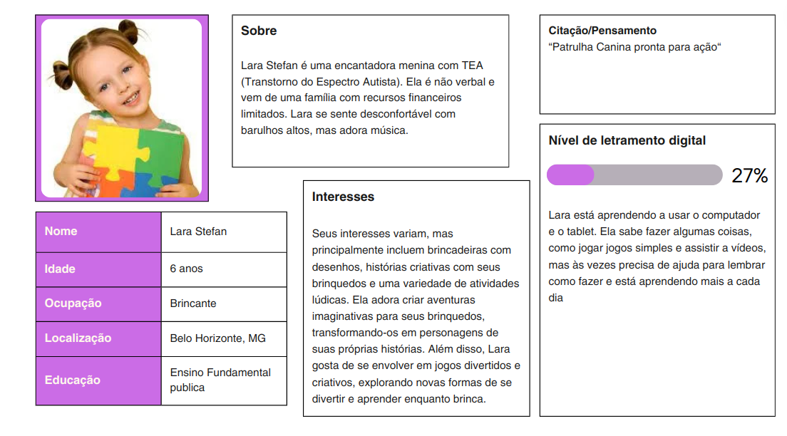
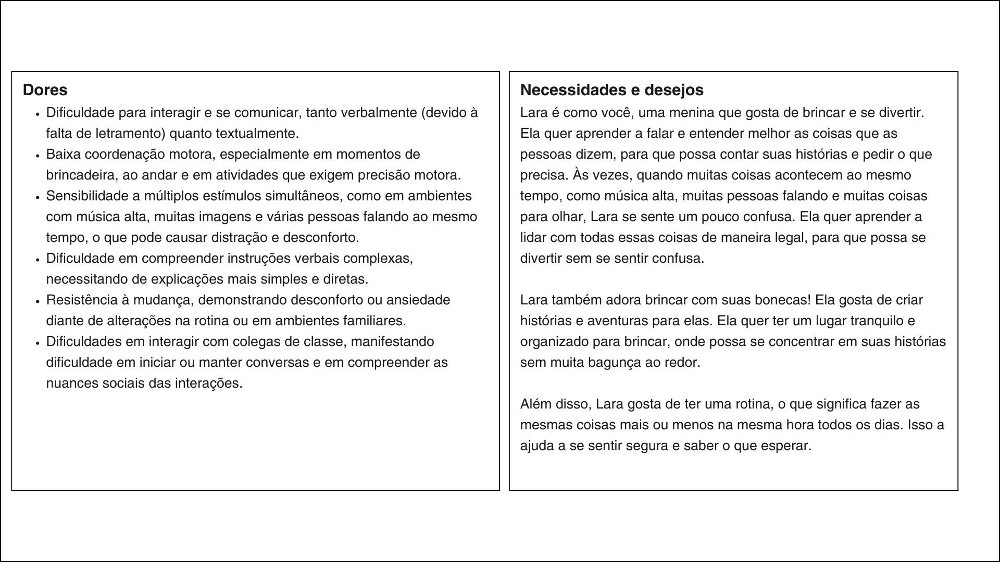
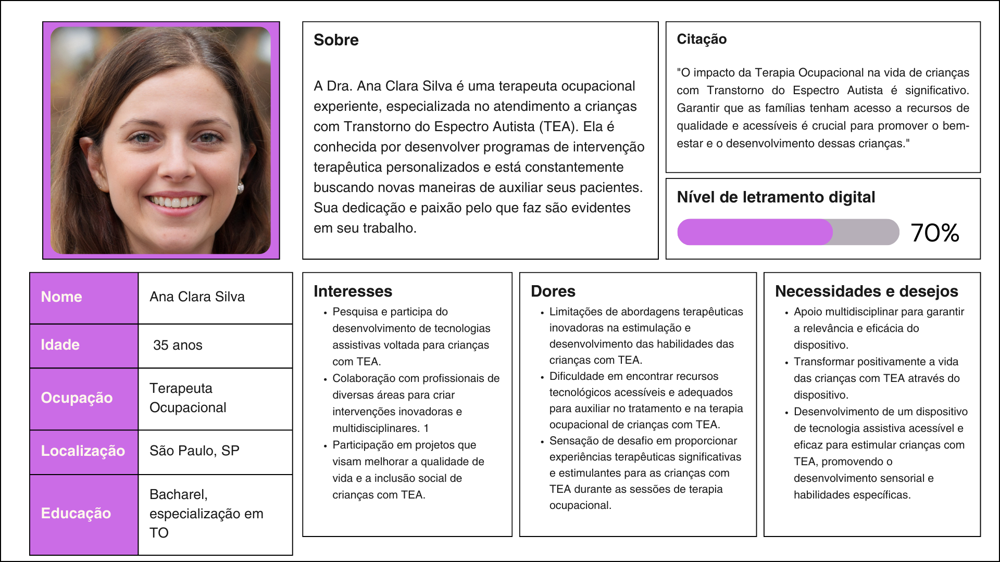
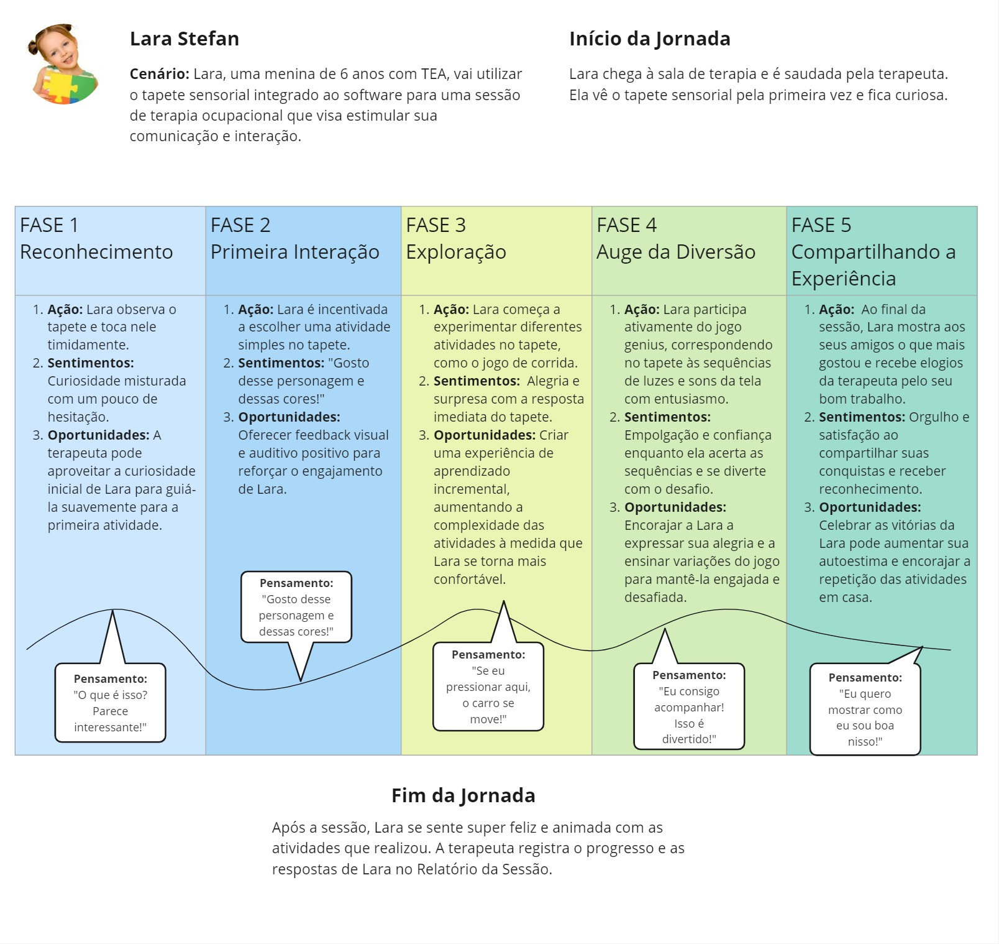
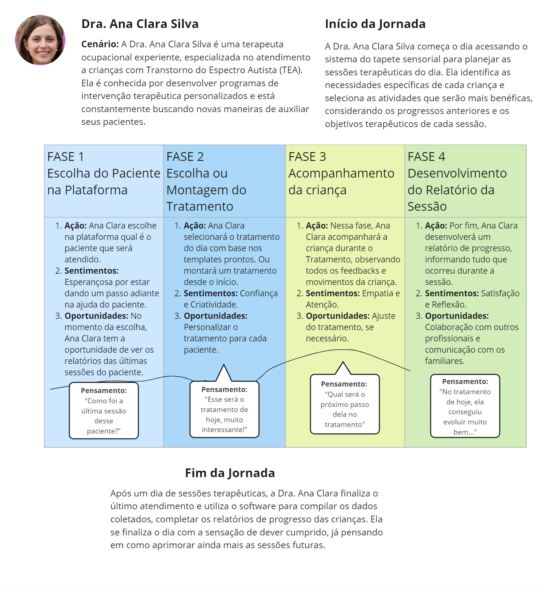

# Entendimento da Experiência do Usuário
Este documento apresenta um entendimento profundo da experiência do usuário para o nosso projeto. Ele se concentra em duas personas principais: Lara Stefan, uma criança de 6 anos com TEA, e a Doutora Ana Clara Silva, terapeuta ocupacional. Através deste artefato, buscamos compreender suas necessidades, objetivos, experiências e frustrações para direcionar a concepção de nossa solução.

## Personas

Criamos perfis abrangentes para nossas duas usuárias-chave: Lara Stefan, uma criança de 6 anos com TEA, e a Doutora Ana Clara Silva, que é bacharel e especialista em terapia ocupacional.

### Persona - Lara Stefan

Figura 1 e 2: Persona 'Lara Stefan'
   
     
  Fonte: Elaborado pelos autores.

### Persona - Doutora Ana Clara Silva

Figura 3: Persona 'Doutora Ana Clara Silva'
   
  Fonte: Elaborado pelos autores.

Ao compreender as necessidades e frustrações de Lara e da Doutora Ana Clara, obtivemos insights valiosos que direcionam a concepção de nossa solução de tecnologia assistiva. Isso nos permite garantir que a solução seja verdadeiramente centrada nas expectativas e prioridades das partes envolvidas, ao mesmo tempo que alivia as complexidades operacionais enfrentadas por elas. As personas de Lara e da Doutora Ana Clara servirão como guias essenciais ao longo do projeto, influenciando o design, o desenvolvimento e a tomada de decisões para garantir que a solução seja eficaz e atenda às necessidades reais dos envolvidos.

## Jornada do usuário
A Jornada do Usuário é uma representação visual ou narrativa que descreve as etapas e experiências de um usuário ao interagir com um produto ou serviço. Ela permite que empresas compreendam as necessidades, sentimentos e desafios enfrentados pelo usuário, identifiquem pontos de melhoria e otimizem a experiência oferecida. Esta ferramenta é crucial para criar estratégias de marketing, design e vendas eficazes, com foco na satisfação e retenção de clientes.

### Jornada do usuário - Lara Stefan

Figura 4: Jornada da 'Lara Stefan'
   
  Fonte: Elaborado pelos autores.

### Jornada do usuário - Doutora Ana Clara Silva

Figura 5: Jornada da 'Doutora Ana Clara Silva'
   
  Fonte: Elaborado pelos autores.

## User Stories
- Título da User Story: Jogar Genius
    - Descrição: Como criança, quero interagir com o jogo Genius no tapete sensorial para que eu possa melhorar minha memória e reconhecimento de padrões de forma divertida.

- Título da User Story: Interagir com Jogo de Corrida
    - Descrição: Como criança, quero interagir com um jogo de corrida, tocando no tapete para acelerar e retirando a mão para parar o carro, para que eu possa me divertir controlando o carro de forma simples e intuitiva.

- Título da User Story: Exploração de Mídia Sensorial
    - Descrição: Como criança, quero escolher entre diferentes opções de som, gif ou imagem exibidas na tela e interagir com elas no tapete sensorial para explorar diferentes estímulos sensoriais e aprender sobre diversos temas.

- Título da User Story: Criação de História Personalizada
    - Descrição: Como terapeuta, quero configurar uma história personalizada (selecionando contexto, personagens e informações adicionais) para que eu possa proporcionar uma experiência envolvente e adequada às necessidades específicas da criança.

- Título da User Story: Personalização de Atividades Terapêuticas
    - Descrição: Como terapeuta, quero acessar uma IDE para personalizar as atividades disponíveis no tapete sensorial (como adicionar/editar/remover contextos ou personagens, sons, gifs e imagens) para adaptar o conteúdo de acordo com as necessidades e interesses de cada criança.

- Título da User Story: Gerenciamento de Pacientes
    - Descrição: Como terapeuta, quero ter uma visão geral de todos os meus pacientes no sistema, acessar seus perfis e iniciar ou pré-definir atividades específicas para cada um, para que eu possa gerenciar eficientemente o acompanhamento terapêutico individualizado.

- Título da User Story: Criação de Relatório Pós-Sessão
  - Descrição: Como terapeuta, quero criar um relatório específico no final de cada sessão para registrar o desempenho e as reações da criança, permitindo um acompanhamento detalhado do progresso e ajustes futuros no plano terapêutico.
